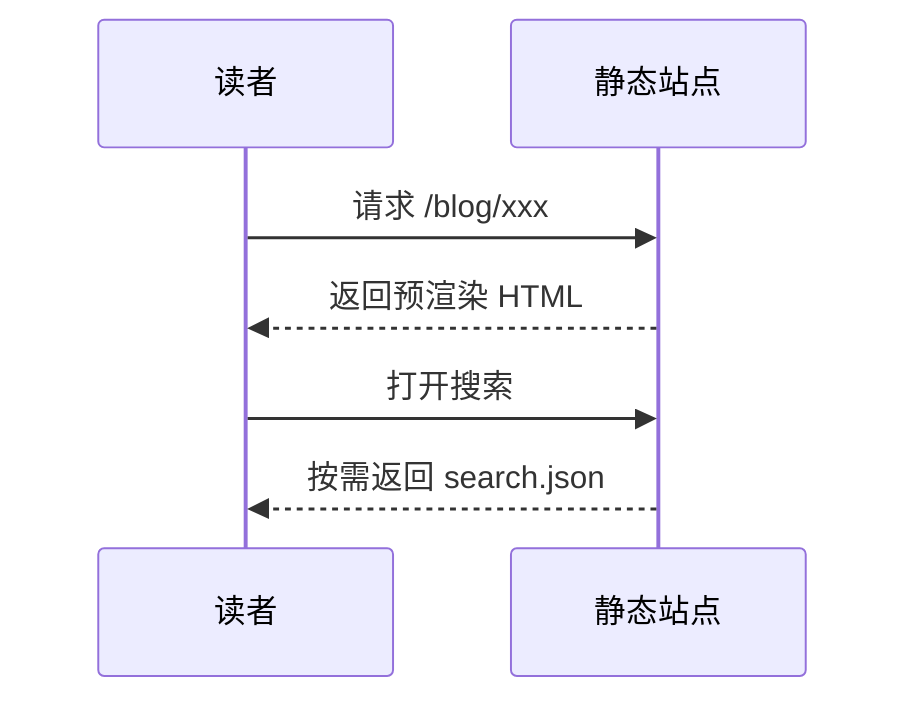

这篇示例把常用的 markdown 语法都过一遍，方便你确认主题的排版是否符合预期。

## 二级标题

### 三级标题

#### 四级标题

文本可以**加粗**、*倾斜*、~~删除线~~、`行内代码`，也可以放[链接](https://astro.build)。

## 列表

无序列表：

- 第一项
- 第二项
  - 嵌套项
  - 另一个嵌套项
- 第三项

有序列表：

1. 先做这个
2. 再做那个
3. 最后收尾

任务列表：

- [x] 已经完成的事
- [ ] 还没做的事

## 引用

> 普通的引用块。
>
> 可以写多段。

## 表格

| 功能 | 依赖 | 默认状态 |
| --- | --- | :---: |
| 搜索 | fuse.js | 开启 |
| 评论 | 七选一 | 关闭 |
| 数学公式 | KaTeX | 开启 |
| 烟花特效 | mouse-firework | 开启 |

## 代码块

带语言标注会自动高亮：

```ts
interface Post {
  title: string;
  pubDate: Date;
  tags?: string[];
}

export function sortByDate(posts: Post[]): Post[] {
  return [...posts].sort((a, b) => b.pubDate.getTime() - a.pubDate.getTime());
}
```

```bash
pnpm install
pnpm dev      # 本地开发
pnpm build    # 构建到 dist/
```

## 数学公式

行内：当 $a \ne 0$ 时，方程 $ax^2 + bx + c = 0$ 有两个解。

独立成行：

$$
x = \frac{-b \pm \sqrt{b^2 - 4ac}}{2a}
$$

## 图表



## 图片

图片放在 `public/` 下用绝对路径引用，或者放在文章旁边用相对路径引用（Astro 会自动做尺寸优化）：

```markdown


```

## 分隔线

---

以上就是全部常用语法。
